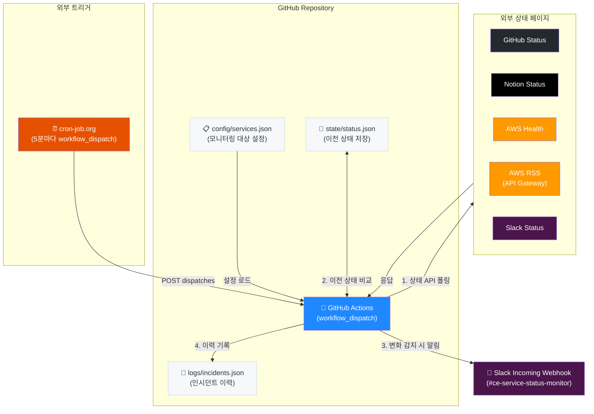

# 외부 서비스 상태 모니터링 & Slack 알림 서비스 계획서

## 1. 개요

### 1.1 서비스 목적

팀이 의존하는 외부 SaaS 서비스(GitHub, Notion, AWS, Slack 등)의 장애 및 상태 변화를 **자동으로 감지**하여 **Slack 채널에 실시간 알림**을 전달하는 모니터링 서비스입니다.

### 1.2 핵심 가치

| 가치               | 설명                                             |
| ------------------ | ------------------------------------------------ |
| **빠른 장애 인지** | 외부 서비스 장애를 5분 내 감지                   |
| **제로 비용**      | GitHub Actions 무료 범위 내 운영                 |
| **인프라 불필요**  | AWS/서버 없이 GitHub 리포지토리만으로 운영       |
| **코드로 관리**    | 모니터링 설정, 로직, 이력 모두 Git으로 버전 관리 |

---

## 2. 아키텍처

### 2.1 전체 구조



### 2.2 핵심 설계 결정

| 항목              | 결정                           | 이유                            |
| ----------------- | ------------------------------ | ------------------------------- |
| **상태 저장**     | Git 커밋 (`state/status.json`) | DB 불필요, 이력 자동 추적, 무료 |
| **설정 관리**     | `config/services.json`         | 코드 리뷰로 변경 관리 가능      |
| **Slack 연동**    | Incoming Webhook               | 단방향 알림에 최적, 설정 단순   |
| **폴링 주기**     | 5분 (cron-job.org)             | 정확한 5분 간격 보장            |
| **인시던트 이력** | `logs/incidents.json`          | Git 커밋으로 이력 자동 보존     |

---

## 3. 모니터링 대상 서비스

### 3.1 모니터링 대상 서비스

| 서비스                  | 상태 페이지 URL                 | API 엔드포인트            | 플랫폼               |
| ----------------------- | ------------------------------- | ------------------------- | -------------------- |
| **GitHub**              | `https://www.githubstatus.com`  | `/api/v2/status.json`     | Atlassian Statuspage |
| **Notion**              | `https://www.notion-status.com` | `/api/v2/status.json`     | Atlassian Statuspage |
| **AWS**                 | `https://health.aws.amazon.com` | `/public/currentevents`   | AWS Health API       |
| **API Gateway (Seoul)** | `https://status.aws.amazon.com` | RSS 피드 (ap-northeast-2) | AWS RSS              |
| **API Gateway (Tokyo)** | `https://status.aws.amazon.com` | RSS 피드 (ap-northeast-1) | AWS RSS              |
| **Slack**               | `https://slack-status.com`      | `/api/v2.0.0/current`     | 독자 API             |

### 3.2 Atlassian Statuspage API (인증 불필요)

| 엔드포인트                          | 용도                                                  |
| ----------------------------------- | ----------------------------------------------------- |
| `/api/v2/status.json`               | 전체 상태 요약 (indicator: none/minor/major/critical) |
| `/api/v2/components.json`           | 개별 컴포넌트 상태                                    |
| `/api/v2/incidents/unresolved.json` | 미해결 인시던트 목록                                  |

### 3.3 설정 파일 (`config/services.json`)

```json
{
  "pollingIntervalMinutes": 5,
  "defaultAlertChannel": "#dev-alerts",
  "services": [
    {
      "name": "GitHub",
      "type": "statuspage",
      "baseUrl": "https://www.githubstatus.com",
      "enabled": true,
      "mentionOnCritical": "@here"
    },
    {
      "name": "Notion",
      "type": "statuspage",
      "baseUrl": "https://status.notion.so",
      "enabled": true
    },
    {
      "name": "Slack",
      "type": "custom_slack",
      "statusUrl": "https://slack-status.com/api/v2.0.0/current",
      "enabled": true
    }
  ]
}
```

**새 서비스 추가**: `services` 배열에 항목 추가 → PR → 머지만 하면 자동 적용

---

## 4. 상세 설계

### 4.1 GitHub Actions 워크플로우

```yaml
# .github/workflows/status-monitor.yml
name: Service Status Monitor

on:
  workflow_dispatch: # cron-job.org 또는 수동 실행

permissions:
  contents: write # state/ 파일 커밋에 필요

jobs:
  check-status:
    runs-on: ubuntu-latest
    steps:
      - uses: actions/checkout@v5

      - uses: actions/setup-node@v5
        with:
          node-version: "22"

      - name: Install dependencies
        run: npm ci
        working-directory: tools/status-monitor

      - name: Check service status
        run: npx tsx tools/status-monitor/check.ts
        env:
          SLACK_WEBHOOK_URL: ${{ secrets.SLACK_WEBHOOK_URL }}

      - name: Commit state changes
        run: |
          git config user.name "status-monitor[bot]"
          git config user.email "status-monitor[bot]@users.noreply.github.com"
          git add state/ logs/
          git diff --cached --quiet || git commit -m "chore: update service status [skip ci]"
          git push
```

### 4.2 처리 흐름

```
1. cron-job.org가 5분마다 GitHub API (workflow_dispatch) 호출
2. GitHub Actions 워크플로우 트리거
3. config/services.json에서 모니터링 대상 로드
4. 각 서비스 상태 API를 병렬 호출 (Promise.allSettled)
5. state/status.json에서 이전 상태 로드
6. 현재 상태와 이전 상태 비교
7. 변화 감지 시:
   a. Slack Webhook으로 알림 전송
   b. logs/incidents.json에 이력 추가
8. state/status.json 업데이트 후 Git 커밋 & 푸시
```

### 4.3 상태 저장 파일 (`state/status.json`)

```json
{
  "lastChecked": "2026-03-26T15:30:00Z",
  "services": {
    "GitHub": {
      "indicator": "none",
      "description": "All Systems Operational",
      "lastChanged": "2026-03-25T10:00:00Z",
      "lastNotified": "2026-03-25T10:00:00Z",
      "consecutiveFailures": 0
    },
    "Notion": {
      "indicator": "major",
      "description": "Major System Outage",
      "lastChanged": "2026-03-26T14:32:00Z",
      "lastNotified": "2026-03-26T14:32:00Z",
      "consecutiveFailures": 0
    }
  }
}
```

### 4.4 상태 변화 감지 로직

```typescript
interface ServiceState {
  indicator: "none" | "minor" | "major" | "critical";
  description: string;
  lastChanged: string;
  lastNotified: string;
  consecutiveFailures: number;
}

function detectChanges(
  previousStates: Record<string, ServiceState>,
  currentResults: Record<string, { indicator: string; description: string }>,
): StatusChange[] {
  const changes: StatusChange[] = [];

  for (const [name, current] of Object.entries(currentResults)) {
    const previous = previousStates[name];

    // 최초 체크인 경우 정상이 아니면 알림
    if (!previous) {
      if (current.indicator !== "none") {
        changes.push({
          service: name,
          previous: "none",
          current: current.indicator,
        });
      }
      continue;
    }

    // 상태 변화 감지
    if (previous.indicator !== current.indicator) {
      changes.push({
        service: name,
        previous: previous.indicator,
        current: current.indicator,
        description: current.description,
      });
    }
  }

  return changes;
}
```

### 4.5 에러 핸들링

| 시나리오            | 처리                                                               |
| ------------------- | ------------------------------------------------------------------ |
| API 타임아웃 (10초) | 해당 서비스 건너뛰기, `consecutiveFailures` +1                     |
| HTTP 4xx/5xx        | 동일하게 `consecutiveFailures` +1                                  |
| 3회 연속 실패       | Slack에 "모니터링 실패" 알림 전송                                  |
| JSON 파싱 실패      | 해당 서비스 건너뛰기                                               |
| Git push 충돌       | `[skip ci]` 커밋이라 거의 발생 안함, 발생 시 다음 주기에 자연 해결 |

### 4.6 GitHub Actions cron 지연 대응

GitHub Actions의 cron은 정확하지 않을 수 있습니다 (1~15분 지연):

- **대응 1**: `state/status.json`에 `lastChecked` 기록으로 실제 간격 추적
- **대응 2**: 중요한 장애는 어차피 지속되므로 다음 주기에 반드시 감지됨
- **대응 3**: `workflow_dispatch`로 수동 즉시 체크 가능

---

## 5. Slack 알림 설계

### 5.1 Incoming Webhook 설정

1. https://api.slack.com/apps → "Create New App" → "From scratch"
2. Features → **Incoming Webhooks** → On
3. "Add New Webhook to Workspace" → `#dev-alerts` 채널 선택
4. 생성된 URL을 GitHub Secrets에 `SLACK_STATUS_WEBHOOK_URL`로 저장

### 5.2 장애 발생 시 알림

```json
{
  "blocks": [
    {
      "type": "header",
      "text": {
        "type": "plain_text",
        "text": ":red_circle: Notion 서비스 장애 발생"
      }
    },
    {
      "type": "section",
      "fields": [
        {
          "type": "mrkdwn",
          "text": "*상태:*\nMajor System Outage"
        },
        {
          "type": "mrkdwn",
          "text": "*감지 시각:*\n2026-03-26 15:30 KST"
        }
      ]
    },
    {
      "type": "section",
      "fields": [
        {
          "type": "mrkdwn",
          "text": "*이전 상태:*\n:large_green_circle: Operational"
        },
        {
          "type": "mrkdwn",
          "text": "*현재 상태:*\n:red_circle: Major"
        }
      ]
    },
    {
      "type": "actions",
      "elements": [
        {
          "type": "button",
          "text": { "type": "plain_text", "text": "상태 페이지 확인" },
          "url": "https://status.notion.so"
        }
      ]
    },
    {
      "type": "context",
      "elements": [
        { "type": "mrkdwn", "text": "Service Status Monitor | 자동 감지" }
      ]
    }
  ]
}
```

### 5.3 복구 시 알림

```json
{
  "blocks": [
    {
      "type": "header",
      "text": {
        "type": "plain_text",
        "text": ":large_green_circle: Notion 서비스 복구 완료"
      }
    },
    {
      "type": "section",
      "fields": [
        {
          "type": "mrkdwn",
          "text": "*상태:*\nAll Systems Operational"
        },
        {
          "type": "mrkdwn",
          "text": "*복구 시각:*\n2026-03-26 16:10 KST"
        }
      ]
    },
    {
      "type": "section",
      "fields": [
        {
          "type": "mrkdwn",
          "text": "*장애 지속 시간:*\n40분"
        },
        {
          "type": "mrkdwn",
          "text": "*이전 상태:*\n:red_circle: Major"
        }
      ]
    },
    {
      "type": "context",
      "elements": [
        { "type": "mrkdwn", "text": "Service Status Monitor | 자동 감지" }
      ]
    }
  ]
}
```

### 5.4 상태별 알림 매핑

| 상태 변화       | 아이콘                | 멘션       |
| --------------- | --------------------- | ---------- |
| → `none` (복구) | :large_green_circle:  | 없음       |
| → `minor`       | :large_yellow_circle: | 없음       |
| → `major`       | :red_circle:          | `@here`    |
| → `critical`    | :rotating_light:      | `@channel` |

### 5.5 알림 중복 방지

- **상태 변화 시에만 알림**: `state/status.json`의 이전 상태와 비교
- **`[skip ci]`**: 상태 커밋이 워크플로우를 재트리거하지 않도록 방지
- **인시던트 ID 추적**: `logs/incidents.json`에 이미 알림 보낸 인시던트 기록

---

## 6. 프로젝트 구조

```
tools/status-monitor/
  package.json
  tsconfig.json
  check.ts               # 메인 실행 스크립트
  src/
    config.ts             # 설정 로더
    poller.ts             # 상태 API 폴링
    parsers/
      statuspage.ts       # Atlassian Statuspage 파서
      slack.ts            # Slack 독자 API 파서
    detector.ts           # 상태 변화 감지
    notifier.ts           # Slack Webhook 알림
    state.ts              # state/status.json 읽기/쓰기
    logger.ts             # logs/incidents.json 이력 기록

config/
  services.json           # 모니터링 대상 설정

state/
  status.json             # 마지막 상태 스냅샷 (Git 커밋으로 관리)

logs/
  incidents.json          # 인시던트 이력 (append-only)

.github/workflows/
  status-monitor.yml      # 5분 cron 워크플로우
```

---

## 7. 구현 로드맵

### Phase 1: MVP (1~2일)

| 작업                                      | 산출물                                 |
| ----------------------------------------- | -------------------------------------- |
| 프로젝트 초기화 (package.json, 기본 구조) | `tools/status-monitor/`                |
| Statuspage API 폴링 + 파서 구현           | `poller.ts`, `parsers/statuspage.ts`   |
| 상태 변화 감지 로직                       | `detector.ts`                          |
| Slack Webhook 알림 전송                   | `notifier.ts`                          |
| state/status.json 읽기/쓰기               | `state.ts`                             |
| GitHub Actions 워크플로우                 | `.github/workflows/status-monitor.yml` |
| Slack App 생성 + Webhook URL 설정         | GitHub Secrets                         |

**MVP 범위**: GitHub/Notion 2개 서비스 상태 모니터링 + 장애/복구 Slack 알림

### Phase 2: 고도화 (3~4일)

| 작업                | 설명                                      |
| ------------------- | ----------------------------------------- |
| Slack 독자 API 파서 | `parsers/slack.ts`                        |
| 인시던트 이력 기록  | `logs/incidents.json` 자동 기록           |
| 에러 핸들링 강화    | 연속 실패 카운터, 모니터링 자체 장애 알림 |
| 컴포넌트 레벨 감지  | `/api/v2/components.json` 활용            |
| 수동 트리거 지원    | `workflow_dispatch` + 입력 파라미터       |

### Phase 3: 확장 (1주)

| 작업                  | 설명                                      |
| --------------------- | ----------------------------------------- |
| 주간 리포트           | 매주 월요일 서비스 가용률 요약 Slack 전송 |
| 커스텀 URL 모니터링   | 내부 서비스 Health Check URL 추가         |
| 멀티 채널 알림        | 서비스별 다른 Slack 채널 라우팅           |
| GitHub Pages 대시보드 | 현재 상태 + 인시던트 이력 웹 UI           |

---

## 8. 비용

| 항목                          | 비용                                                     |
| ----------------------------- | -------------------------------------------------------- |
| GitHub Actions (public repo)  | **무료** (무제한)                                        |
| GitHub Actions (private repo) | **무료** (월 2,000분, 5분×288회/일×30일 = 약 720분 사용) |
| Slack Incoming Webhook        | **무료**                                                 |
| **합계**                      | **$0/월**                                                |

> private repo에서도 월 2,000분 무료 한도의 약 36%만 사용하므로 충분합니다.

---

## 9. 제약 사항 및 대응

| 제약                | 영향                                | 대응                                            |
| ------------------- | ----------------------------------- | ----------------------------------------------- |
| cron 최소 5분 간격  | 장애 감지까지 최대 5~20분 소요 가능 | 대부분의 장애는 지속적이므로 다음 주기에 감지됨 |
| cron 정확도 미보장  | 1~15분 지연 발생 가능               | 즉각적 감지가 필수인 경우 수동 트리거 활용      |
| Git push 필요       | 상태 저장에 Git 커밋 사용           | `[skip ci]`로 무한 루프 방지, 충돌 최소화       |
| 워크플로우 비활성화 | 60일 커밋 없으면 cron 자동 비활성화 | keepalive 워크플로우 또는 주기적 빈 커밋        |

### 60일 비활성화 방지

```yaml
# .github/workflows/keepalive.yml
name: Keepalive
on:
  schedule:
    - cron: '0 0 1 * *'  # 매월 1일
jobs:
  keepalive:
    runs-on: ubuntu-latest
    steps:
      - uses: actions/checkout@v4
      - run: git commit --allow-empty -m "chore: keepalive [skip ci]" && git push
```
